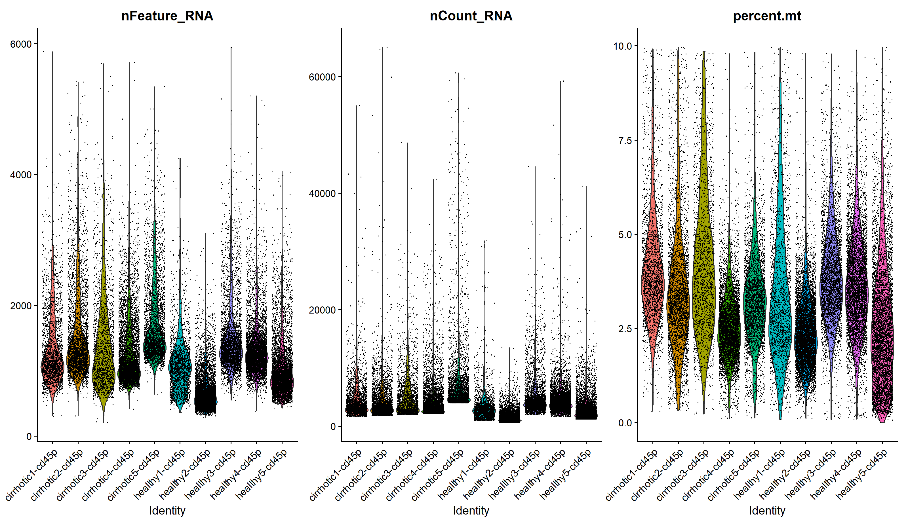
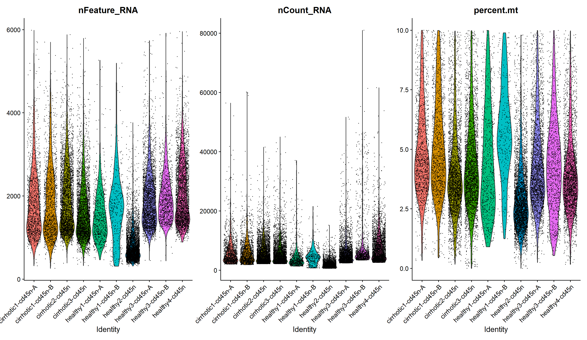
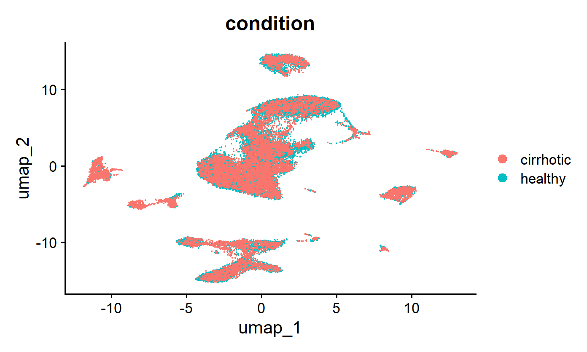
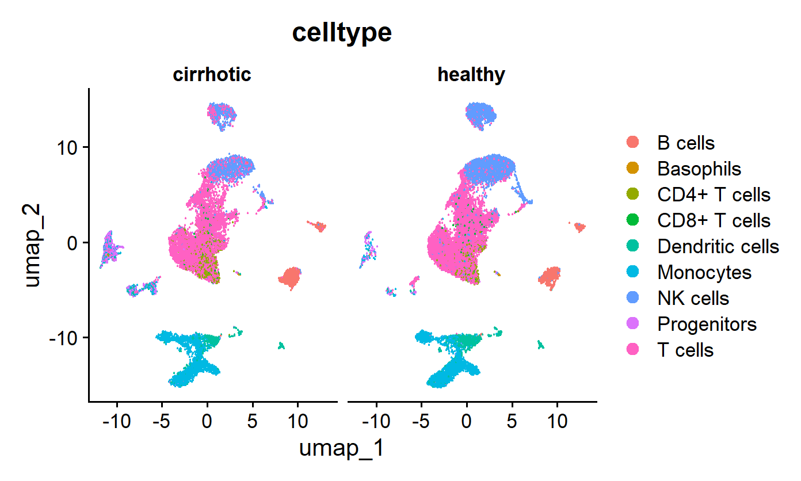
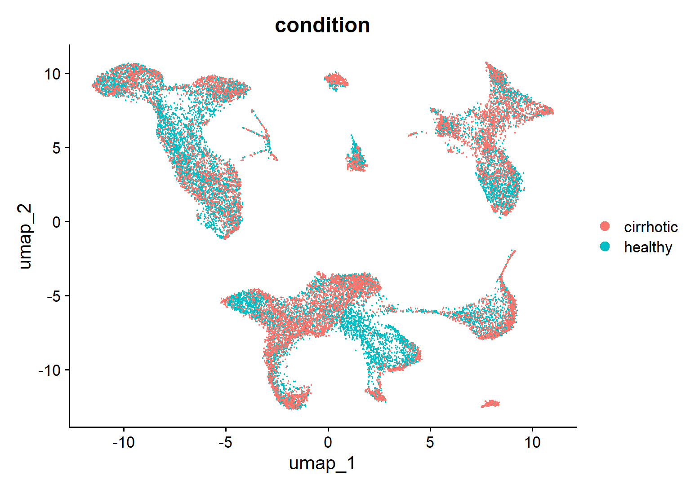
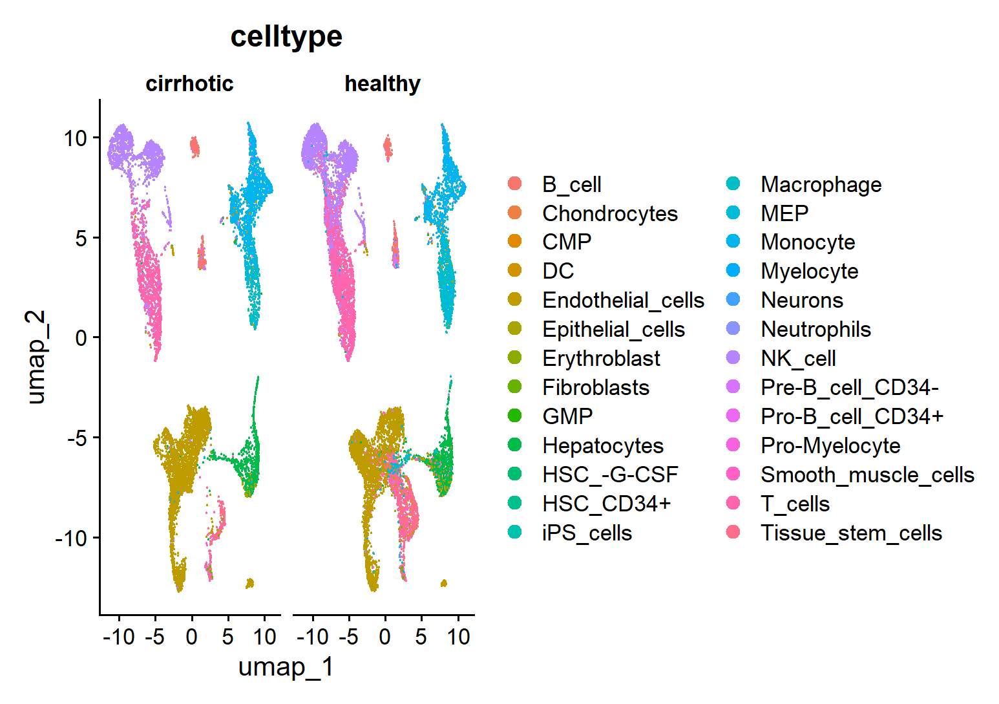
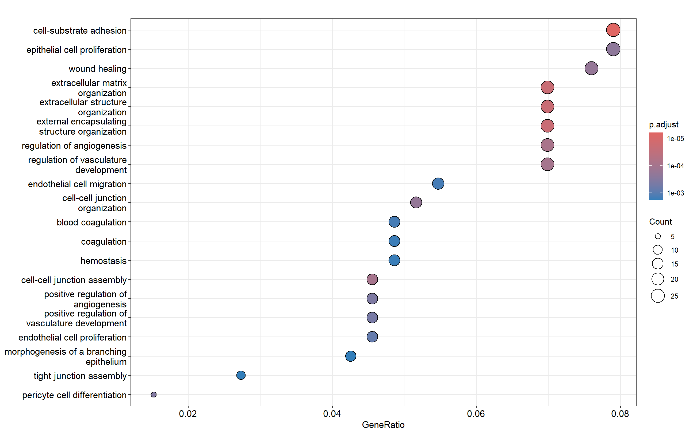
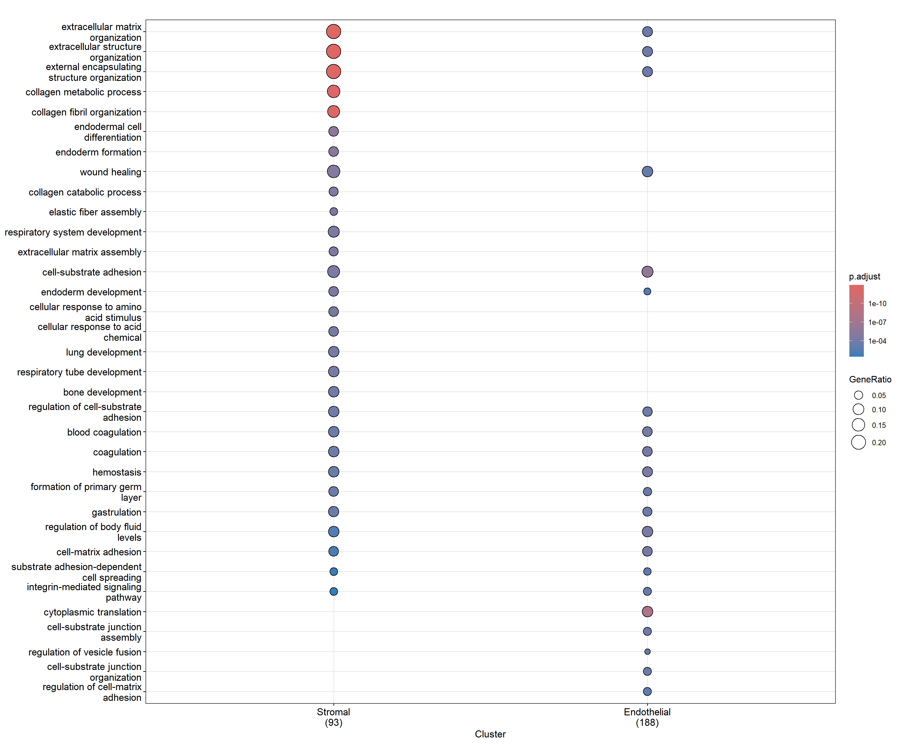
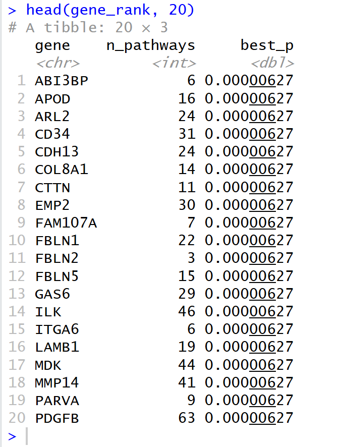
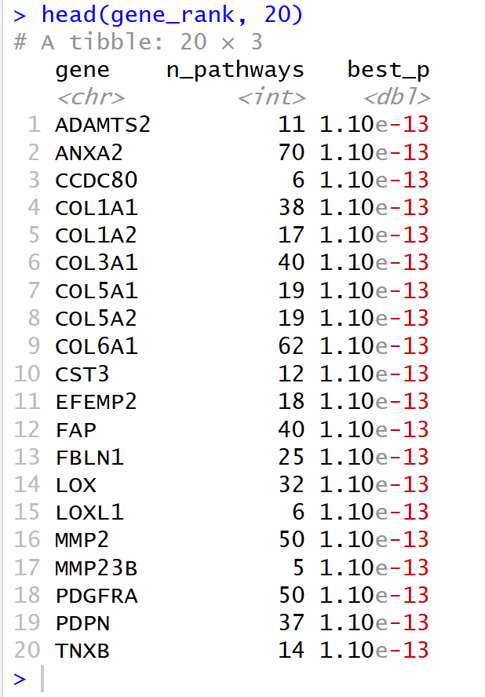

# KaryonBio-scRNA-Pipeline
This is a Mini-Pipeline Project for Discovery and Prioritization of Cell-Type-Specific Biomarkers in Human Liver Fibrosis.

## Introduction
The primary dataset of this pipeline is GSE136103 (https://www.ncbi.nlm.nih.gov/geo/query/acc.cgi?acc=GSE136103), the primary article is 'Resolving the fibrotic niche of human liver cirrhosis at single cell level' (https://pubmed.ncbi.nlm.nih.gov/31597160/). This is an end-to-end analysis workflow that
- identifies fibrosis-associated cell populations
- discovers cell-type-specific fibrosis biomarkers 
- prioritizes a short list of translational biomarker or therapeutic target candidates.

There are two pipelines for analyzing human liver fibrosis: one for leucocyte (CD45+) cells, the other for other non-parenchymal NPC (CD45-) cells.


### File Combinations as Pipelines
#### CD45+ Pipeline
**'scRNA-pipeline-human-immune.R'**, for CD45+ human liver cells, perform sample loading, QC analysis,  PCA+UMAP, and cell annotation.

**'scRNA-pipeline-downstream-immune.R'**, following up the CD45+ cell annotation, this script builds pseudobulk on the previous result, then runs DESeq2 and GO analysis.

#### CD45- Pipeline

**'scRNA-pipeline-human-other.R'**, for CD45- human liver cells, perform sample loading, QC analysis,  PCA+UMAP, and cell annotation.

**'scRNA-pipeline-downstream-other.R'**, following up the CD45- cell annotation, this script builds pseudobulk on the previous result, then runs DESeq2 and GO analysis.

## Running Instructions

### Instructions BEFORE Running the Pipeline

#### Data Preparation

<mark>CRITICAL</mark>: Please download and unzip the dataset file from the provided link. After that, you will see a list of healthy/cirrhotic human liver cell files, healthy/cirrhotic human blood files, and healthy/cirrhotic rodent files. Each sample sequencing generates 3 corresponding file: barcodes.tsv.gz, genes.tsv.gz, and matrix.mtx.gz.

For each cell type and sequencing batch, for example, `GSM4041151_healthy1_cd45-A_barcodes.tsv.gz`, `GSM4041151_healthy1_cd45-A_genes.tsv.gz`, and `GSM4041151_healthy1_cd45-A_matrix.mtx.gz`, create a folder parallel to the running R script named `human_healthy1_cd45-A`. Paste the three files inside, and rename them as `barcodes.tsv.gz`, `features.tsv.gz`, and `matrix.mtx.gz` in order to enable Seurat to load and create Seurat object. 

After you do this step, you will have a list of folders, each containing `barcodes.tsv.gz`, `features.tsv.gz`, and `matrix.mtx.gz`. You will now be able to run all the R scripts.

Please be aware that our pipelines only process human liver cell data, which start with `GXXXXXX_healthyX_cd45X`.

#### Environment Preparation

Please run the following command to prepare yourself the necessary packages load to your environment.

```{r}
# Install BiocManager
install.packages("BiocManager")

# Install CRAN packages
install.packages(c(
  "Seurat",
  "dplyr",
  "ggplot2"
))

# Install glmGamPoi (CRAN)
install.packages("glmGamPoi")

# Install Bioconductor packages
BiocManager::install(c(
  "SingleR",
  "celldex",
  "DESeq2",
  "edgeR",
  "clusterProfiler",
  "org.Hs.eg.db"
))
```

#### Storage Preparation
Please allow 20GB ~ 30GB available computer storage to hold the intermediate data and the final result for the pipeline.

### Instructions TO Run the Pipeline

#### To run the CD45+ pipeline:
Firstly run `scRNA-pipeline-human-immune.R`, it will create a RDS file called `cd45p_integrated_annotated.rds`. This is our Seurat object.
Then run `scRNA-pipeline-downstream-immune.R`, this will pick up the generated `cd45p_integrated_annotated.rds` file, and proceed with the DE and pathway analysis.

#### To run the CD45- pipeline:
Firstly run `scRNA-pipeline-human-other.R`, it will create a RDS file called `cd45n_integrated_annotated.rds`. This is our Seurat object.
Then run `scRNA-pipeline-downstream-other.R`, this will pick up the generated `cd45n_integrated_annotated.rds` file, and proceed with the DE and pathway analysis.

#### Please Note
There will be intermediate plots generated from both files. You can always check, zoom, export, and save those images from RStudio console.

## Running Results

### QC Summary

Overall, standard quality control was performed on Both CD45+ and CD45- samples by examining three key metrics: the number of detected genes (nFeature_RNA), total UMI counts (nCount_RNA), and mitochondrial RNA percentage (percent.mt). Violin plots show that most samples exhibit comparable distributions of gene and UMI counts, indicating consistent sequencing depth across donors. Mitochondrial percentages remain low and within acceptable QC thresholds, suggesting good cell viability and minimal stress‑related artifacts. All samples passed QC for downstream integration and analysis.

Here is the QC violin plot for **CD45+** pipeline after data integration.



This is the QC violin plot for **CD45-** pipeline after data integration.




### Cell Annotation Figures

#### CD45+ (leucocyte cells)

UMAP visualization of CD45⁺ cells shows clear separation of major leukocyte populations, including monocytes, T cells, B cells, NK cells, dendritic cells, and progenitors. As expected for CD45⁺ enrichment, all detected clusters correspond to immune lineages, with no stromal or endothelial contamination. Both cirrhotic and healthy samples contribute to each immune population, indicating successful integration across donors.



#### CD45- (other non-parenchymal NPC)
UMAP visualization of CD45⁻ cells reveals diverse non‑parenchymal cell populations, including endothelial cells, fibroblasts, smooth muscle cells, stromal cells, and multiple hematopoietic progenitor states. As expected for CD45⁻ enrichment, these clusters represent non‑immune NPC compartments rather than leukocytes. Both cirrhotic and healthy samples contribute to the major NPC lineages, indicating successful integration and consistent annotation.



### Differential Expression and Pathway Results

Pathway analysis revealed distinct biological programs between CD45⁺ immune cells and CD45⁻ non‑parenchymal compartments.

In the CD45⁺ dataset, enrichment was driven primarily by the macrophage/monocyte population, consistent with their role as the dominant leukocyte subset in non‑parenchymal liver tissue. These cells showed activation of inflammatory and immune‑related pathways, reflecting their involvement in cirrhosis‑associated immune remodeling.


In contrast, CD45⁻ enrichment focused on non‑immune NPC populations. Although three cell groups were analyzed—hepatic stellate/mesenchymal/myofibroblast‑like cells, macrophage/monocyte populations, and endothelial cells—significant enrichment emerged only from the stromal (HSC‑like) and endothelial compartments. Stromal cells showed strong activation of extracellular matrix organization, collagen fibril assembly, wound healing, and integrin‑mediated adhesion pathways, consistent with classical fibrogenic activation. Endothelial cells exhibited enrichment in angiogenesis, vascular remodeling, coagulation, and endothelial development pathways, reflecting endothelial dysfunction and vascular remodeling in cirrhosis.


### Ranked Biomarker / Target Table

Genes are ranked based on two criteria: (1) the number of enriched GO pathways each gene appeared in (n_pathways), reflecting its centrality in fibrosis‑related biological processes; and (2) the smallest adjusted p‑value among those pathways (best_p), representing the strength of pathway‑level evidence. Genes with high pathway frequency and strong pathway significance were prioritized as candidate biomarkers or therapeutic targets.

Here is the generated **CD45+** biomarker gene table:


Here is the generated **CD45-** biomarker gene table:


